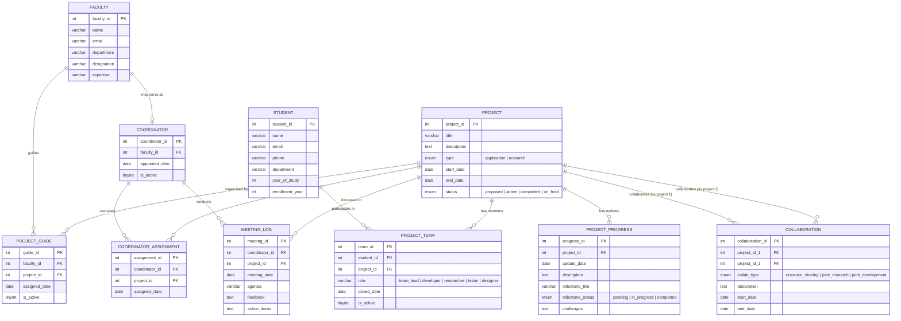

# Conceptual Schema — ER Diagram

## Student Project Management System

This ER diagram represents all entities, attributes, and relationships for the student project management database.

---

## Entity Descriptions

| Entity | Description |
|---|---|
| **Student** | Undergraduate engineering student enrolled in the program |
| **Project** | A project undertaken by a team — either application-based or research-based |
| **Faculty** | Faculty members who can serve as guides or coordinators |
| **Project Team** | Associative entity linking students to projects with designated roles |
| **Project Guide** | Associative entity mapping faculty to projects they supervise |
| **Coordinator** | A subset of faculty serving as project coordinators |
| **Coordinator Assignment** | Links coordinators to the projects they monitor |
| **Meeting Log** | Records of meetings conducted by coordinators for each project |
| **Project Progress** | Tracks milestones, updates, and challenges for each project |
| **Collaboration** | Captures inter-project collaborations (resource sharing, joint work) |

---

## Key Relationship Rules

1. **Student → Project**: Many-to-Many via `PROJECT_TEAM`, but constrained so a student can only be in **one active project** at a time (`is_active = 1` unique constraint).
2. **Faculty → Project (as Guide)**: Many-to-Many via `PROJECT_GUIDE` — a faculty member can guide multiple projects.
3. **Faculty → Coordinator**: One-to-One optional — only some faculty serve as coordinators.
4. **Coordinator → Project**: Many-to-Many via `COORDINATOR_ASSIGNMENT`.
5. **Project ↔ Project**: Self-referencing Many-to-Many via `COLLABORATION`.
6. **Project → Progress**: One-to-Many — each project has multiple progress entries.
7. **Coordinator + Project → Meeting Log**: One-to-Many — multiple meetings per coordinator-project pair.
